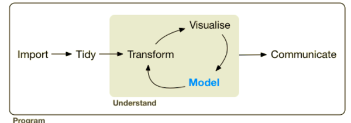
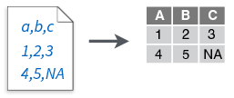
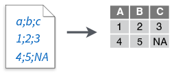
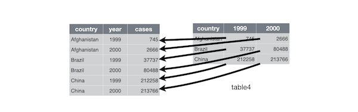
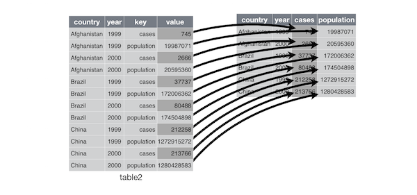
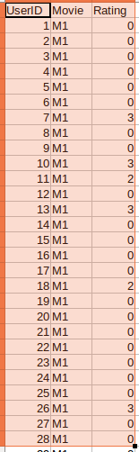
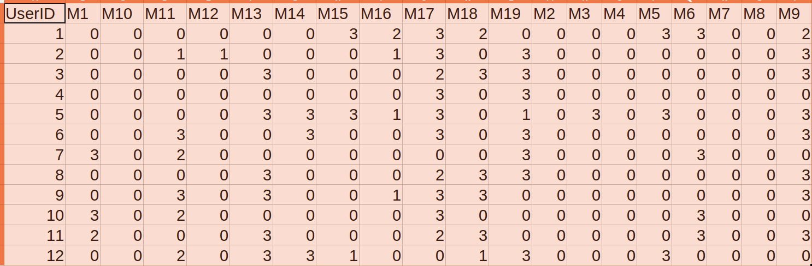

# Requirements for the Lab

* Please ensure that you have "nycflights13" and "tidyverse" packages installed on your machines to run the code in today's activity without any problems

* We will be exploring a dataset from the nycflights13 package using the dplyr library

* tidyverse is a collection of R packages that follow a set of principles based on tidy data (more about it later)

```{r}

# Uncomment and run the following code to install the prerequisite pacakges

# install.packages("nycflights13")

# install.packages("tidyverse")

```

# Loading the Dataset

* Let us load the nycflights13 library and store the flights dataset from the library in a variable

* This data frame contains all 336,776 flights that departed from New York City in 2013. The data comes from the US Bureau of Transportation Statistics, and is documented in ?flight

* Look at the structure and summary of the data

```{r}

library(nycflights13)

flights_data <- flights

str(flights_data)

summary(flights_data)

head(flights_data)

```

* Look at the class of the dataset and you will find that it is tbl_df

```{r}

class(flights_data)

```

So, __What is a tibble?__

* You will see that the class of the data is not just a data frame but also a "tbl_df" and "tbl", tibbles are an extension of the data frames and print data in a more consistent format and also some other fancy stuff along with it!

* But for all practical purposes, you can consider tibbles as data frames, as all the operations that work on data frames also work on tibbles

# Tidyverse

* The Data Science and Analysis pipeline has the following stages




* Tidyverse are a set of several R packages, that have a consistent interface and aid in the process of data analysis using R. 

> “The tidyverse is an opinionated collection of R packages designed for data science.” - Hadley Wickahm

* The following R packages form the core of the tidyverse:

    - `tidyr` : Used for coverting data from wide to long format and viceversa
    - `dplyr` : Used for data wrangling
    - `maggritr` : Used for the `%>%` pipe operator for chaining functions
    - `tibble` : Used __impicitly__ for a more consistent data frame experience 
    - `ggplot2` : Used for Data Visualisation (Will be covered in the data visualisation class)


* Below, we can see how the tidyverse set of packages fit into the Data Science pipeline.


__NOTE:__ It is not always necessary to use the tidyverse packages and there are many other alternatives for most of these parts, tidyverse is mostly famous for data wrangling and data visualization

# Importing Data

* The first step in the data science process is actually importing the data into the R environment

* Beofore we look at the various functions in the `tidyverse` to help us import data, let us understand how these tabular data formats are stored

## Anatomy of Various Tabular Data Formats

* The fields / columns are generally seperated by a delimiter (mostly a comma), each observation / row generally ends with a newline character







## Using the readr and readxl packages

* The readr package is a part of the tidyverse group of packages, these packages follow some core principles and provide significant speed imporvements over the built in R functions

* The readr package provides us with read_csv() function along with other functions to import data

- Seven file formats are supported by the readr package:
    + `read_csv()`: comma separated (CSV) files
    + `read_tsv()`: tab separated files
    + `read_delim()`: general delimited files
    + `read_fwf()`: fixed width files
    + `read_table()`: tabular files where colums are separated by white-space.
    + `read_log()`: web log files


```{r}

#install.packages("readr")

library(readr)

readr_df <- read_csv(file = "data/German-Credit_1.csv", col_names = T)

head(readr_df)

class(readr_df)

```

* Now, let us look at how we read excel files using the readxl package

To import excel files (`.xls` and `.xlsx`):

- `read_excel()`
    + `read_xls()`
    + `read_xlsx()`

* The sheet argument gives you the ability to read in your desired sheet

```{r}

# install.packages("readxl")

library(readxl)

xlsheet_df <- read_excel(path = "data/German-Credit.xlsx", sheet = 1)

xlsheet_df <- read_excel(path = "data/German-Credit.xlsx", sheet = 2)

```


## Suggested reading 

- [Documentation for the readr package](http://readr.tidyverse.org/)

- [Documentation for the readxl package](http://readxl.tidyverse.org/)


# Foundations of tidyr

* Tidyr is a package that helps us convert the data back and forth between __wide__ and __long__ formats






* There will be few times when you want the data to be in a different shape for analysis compared to the shape of the data during storage

* Here, we will look at a case of a Movie Subscription company,
    
    - Since the company uses an RDBMS solution, they store the data with three columns (UserID, Movie, Rating) as follows :
    

    
    - But, the Senior data scientist you work for has asked you to give the data set as follows for building a recommendation engine:
    


## Import the Data

* Read in the `MovieRatings.csv` as follows

```{r}

movie_data <- read.csv('data/MovieRatings.csv')

```

## Spreading Data

* The argument _key_ in the function spread is passed the column name whose values we want as the column names in the resulting data frame

* The argument _value_ in the function spread is passed the column name whose values we want in the cells of the resulting data frame

```{r}

# install.packages("tidyr")

library(tidyr)

head(movie_data)

movie_spread_data <- spread(data = movie_data, key = "Movie", value = "Rating")

head(movie_spread_data)

```

## Gathering Data

* The _key_ argument in the gather function is passed a name for the column where we want our original columns' names are to be present as the values in the created dataframe

* The _value_ argument in the gather function is passed a name for the column where we want the values in the existing cells to be present 

```{r}

movie_original_data <- gather(data = movie_spread_data, key = "Movie", value = "Rating", 2:20)

head(movie_original_data)

```

# Foundations of dplyr

## The main functions in dplyr

* dplyr is a library used for data manipulation, it builds functions focusing on the most common tasks in the data manipulation pipeline

* These are 6 main functions, also known as verbs in dplyr :

    - `select()` : Subsets data using column names

    - `filter()` : Subsets data using values in a column name (Using a conditional expression)
    
    - `arrange()` : Order the rows based on the values in ascending or descending order
    
    - `mutate()` : Create a new column by performing operations using current columns [ Ex: new_col = (col1 + col2) / col3 ]
    
    - `group_by()` : Using this function allows us to selectively apply functions on specific parts of the dataset (Mean Age of Males and Females in the dataset)
    
    - `summarise()` : When used in conjunction with the `group_by()` function it helps to collapse multiple values to a single summary statistic [ Ex : __Sum__ of Orders grouped by month ]
    
    
* When using functions from the dplyr package, wherever we refer to column names we do not use quotes [ Ex: col_name instead of "col_name"]


## Using the `select()` function

* Let us now subset the year, month, day, and carrier columns from the flights dataset

* We need to refer to the columns that we want to subset without quotes after passing in the data frame

### Explicitly stating the column names

```{r}

library(dplyr)

subsetted_data <- select(flights_data, year, month, day, carrier)

subsetted_data

```

### Passing a sequence of column names

* We can also pass in a sequence of columns instead of explicitly mentioning all the column names `year:day` would select `year, month, day`

          col_one : col_five  ------------> col_one, col_two, col_three, col_four, col_five

```{r}

subsetted_data <- select(flights_data, year:day, carrier)

subsetted_data

```

### Passing column names that are not needed using `-`

* You can also subset columns using `-` operator, it would return all columns excluding the mentioned columns

```{r}

subsetted_data <- select(flights_data, -(dep_time : time_hour))

subsetted_data

```

## Using the `filter()` function

* The `filter()` function lets you specify the values of column by which you want to subset your data

* We can pass in as many conditional expressions as we want, just remember that the column names should not be in quotes

```{r}

filter(flights_data, month == 8, day == 2, carrier == "UA", dep_time == 520)

```

* Below we have a set of relational operators for your reference


## Using the `arrange()` function

* The `arrange()` function takes in a bunch of column names and sorts them in the ascending order by default

* Each column name passed into the `arrange()` function after the first column name is used to break ties

* If we want the order of the rows in a dataframe to be in a descending order based on  a paricular column's values, we wrap that column inside the `desc()` function

```{r}

arrange(flights, year, month, desc(day))

```


## Feature Engineering using the `mutate()` function

* As with all the other functions from the dplyr package, the first argument is the data frame

* The other arguments are the columns we want to create, should follow the structure "new_col = col1 + col2"

* Let us now create new columns time_gain, air_time_hours and time_gain_per_hour using the pre existing columns

```{r}

mutate(flights,
  time_gain = arr_delay - dep_delay,
  air_time_hours = air_time / 60,
  time_gain_per_hour = time_gain / air_time_hours
)

```


## Summarising and Grouping Data

* The `group_by()` function helps us group multiple records into one using a particualar value. Ex : Group all the rows for a given year

* The `summarise()` function helps us compute an aggregate statistic given all the grouped rows

* Using the `group_by()` and and `summarise()` functions let's compute the average departure delay per month

### Understanding the `group_by()` function

* We pass in the data frame and the columns we want to group by to the `group_by()` function

* Only performing the `group_by()` function does not change anything in the dataset

```{r}

data_by_month = group_by(flights_data, month)

data_by_month

```

### Understanding the `summarise()` function

* The `summarise()` function helps us compute aggregate statistics that reduce these combined rows to one
      
* So, for the `summarise()` function we pass in the grouped data frame and mention the summary statistic we want to compute along with it's column name

> Ex: `summarise(gender_grouped_df, avg_age = mean(age))`
      
```{r}

summarise(data_by_month, avg_delay = mean(dep_delay, na.rm = T))

```

# Exercise: dplyr basics

1) Find all flights that

  - Had an arrival delay of two or more hours
  - Flew to Houston (IAH or HOU)
  - Were operated by United, American, or Delta
  - Departed in summer (July, August, and September)
  - Arrived more than two hours late, but didn’t leave late
  - Were delayed by at least an hour, but made up over 30 minutes in flight
  - Departed between midnight and 6am (inclusive)

2) How many flights have a missing dep_time? What other variables are missing? What might these rows represent?

3) What happens if you include the name of a variable multiple times in a select() call?

4) Sort flights to find the most delayed flights. Find the flights that left earliest.


# Using the Pipe `%>%` Operator

* As you might've noticed till now, using these functions together would improve our productivity as data engineers, so let's look at how our code would look like of we use multiple functions in a single line


* The `%>%` operator makes it very simple to chain function calls and makes it very easy to read the code

* The `%>%` operator by default passes the output of a function to the next function


* Also, the `%>%` operator helps us write more memory efficient code by removing the need to store intermediate data frames


## Example of data munging using the `%>%` operator

* Below we look at an example putting all the elements together


```{r}

flights %>% 
  group_by(dest) %>% 
  summarise(count = n(), dist = mean(distance, na.rm = TRUE),
    delay = mean(arr_delay, na.rm = TRUE)) %>% 
  filter(count > 20)

```

# Exercise Questions

1) Find the monthly average departure delay as the column "mean_dep_delay" and sum of the distance that all the flights travel per month as the column "total_dist" originating at the JFK airport in New York City

```{r}
flights %>%
  filter(origin == 'JFK') %>%
  group_by(month) %>%
  summarise(mean_dep_delay = mean(dep_delay, 
                                    na.rm = T), total_distance = sum(distance))
            
            
```


2) 

a) Calculate the number of flights delayed monthly for each origin every month airport, when the scheduled departure time for the flight is between 10 and 11 P.M. Also, order the ouptut by the month. 
```{r}
flights %>%
  filter(sched_dep_time >= 2200 & sched_dep_time <= 2300 & dep_delay > 0) %>%
  group_by(origin, month) %>%
  summarise(count = n())
  

```
b) Finally find the average number and the standrd deviation of flights delayed per month for each origin airport

_Hint_ : for dep_delay > 0, consider that the flight is delayed and the sched_dep_time would be between 2200 and 2300

```{r}

```


3) Which origin airport has the highest proportion of flights that are delayed

```{r}


```


